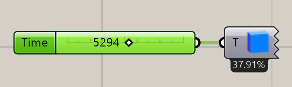
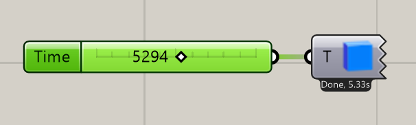
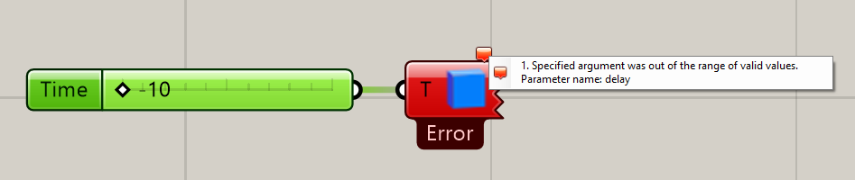

# Async component for Rhino Grasshopper.

No more freezed UI

Contains abstract component to implement. Enables async-await workflow and executes on the Thread Pool.

Features:

* Async-await workflow worker
* Execution time measurement
* Exceptions reroute to the component error messages
* Custom completion messages
* Progress reports

